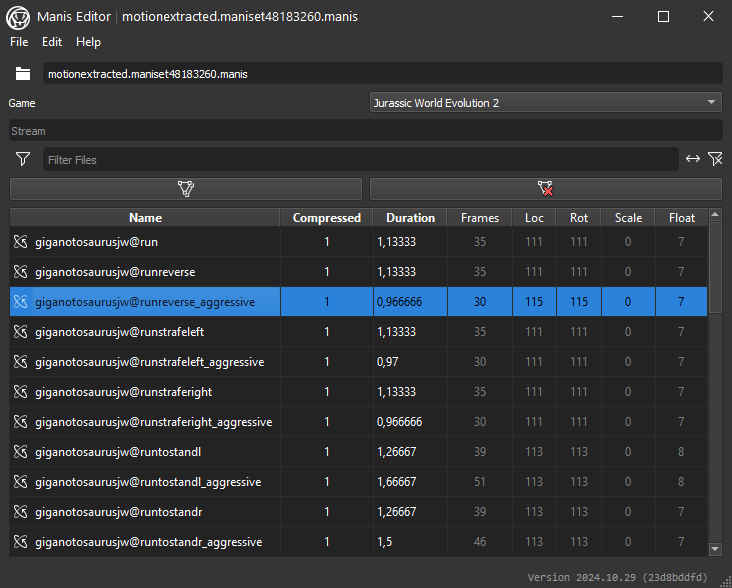

# Animations

The Cobra engine uses two different kinds of animation formats: `.manis` containers with `.mani` animations and `.banis` containers with `.bani` animations. Extracted from OVL, you get the `.manis` and `.banis`.

## Manis

`.manis` animations are sampled across all frames for different bones and transform channels. They are generally used for advanced character animation that requires dynamics, constraints or blending between animations.

### Import

Select a target armature you want to animate before importing a `.manis` file.

!!! construction "Limitations"
    - Most anims are stored as compressed data, which must be decompressed before being imported.
    - Not all anims decompress correctly. If an anim fails to decompress, you may see no keyframes at all or a distorted mess.
    - When anims do decompress, single keyframes or whole channels may still show unexpected distortions.
    - Decompression is fairly slow. Keep track on the progress by turning on Blender's console (Window > Toggle System Console) before importing. If you have to import the same `.manis` repeatedly, consider using the [Manis Editor](#manis-editor) to decompress it once and for all.

!!! danger "IMPORTANT" 
    To import compressed animations, the ``bitarray`` Python module must be installed in Blender's bundled Python.
    
    - Running Blender with administrator privileges, you can press the red button in the tools' settings (Edit > Preferences > Addons > Cobra Tools). Restart Blender after downloading.

        {data-gallery="tools"}

    - If the automatic process fails, you can install the module manually:
         
        1) Open a command prompt (not power shell) with admin privileges in the following folder (your blender version may vary, of course): ``C:\Program Files\Blender Foundation\Blender 4.0\4.0\python\bin``

        2) In that prompt, run this command: ``python.exe -m pip install bitarray``
    
        {data-gallery="tools"}

### Export

Transforms in blender actions are stored relative to the armature, but absolute in `.manis`. As a result, `.manis` export must know which actions belong to which armature:

- If you have a single action per armature, setting it as the current action in the [Action Editor](https://docs.blender.org/manual/en/latest/editors/dope_sheet/modes/action.html#header) is enough.
- To export multiple actions from an armature, stash them in the [NLA Editor](https://docs.blender.org/manual/en/latest/editors/nla/tracks.html#action-stashing) or the [Action Editor](https://docs.blender.org/manual/en/latest/editors/dope_sheet/modes/action.html#header).

!!! info "Gotchas"
    - Export does not read the keyframes directly, but samples the visual transforms across an action's frame range. 
    - Constraints are automatically baked. 
    - Bones are included as needed; bones that don't move during an action are automatically discarded.

!!! construction "Limitations"
    - Export only produces uncompressed animations, which occupy a lot of disk space and RAM bandwidth in-game. The game uses compressed animations for almost everything.
    - If you plan on editing only some animations of a `.manis`, insert the modified (= uncompressed) ones into the compressed `.manis` file using the [Manis Editor](#manis-editor).

### Scaling

A command line script is provided to scale compressed animations and ms2 models by a given factor. Call it from a CMD or PowerShell window like this:

!!! example "CMD"
    ``python resize_manis_cmd.py [FOLDER] [SCALE_FACTOR]``

    ``python resize_manis_cmd.py "C:\Users\USER\Desktop\tiger" 1.4``

### Manis Editor

A GUI editor to manipulate `.manis` files.

{data-gallery="tools"}

!!! example "Use Cases"
    - changing speed of anims
    - decompressing anims
    - renaming / deleting / appending anims

## Banis

`.banis` animations hold rigidly sampled location and rotation keys for all bones in a model. They are generally used for simple building or character animations, such as:

- guests
- feeders
- exhibit animals

!!! construction "Limitations"
    The transforms used by `.banis` are currently not fully understood. Import is experimental and close to expected for some `.banis`, but totally broken for others. Export is not useable in production.